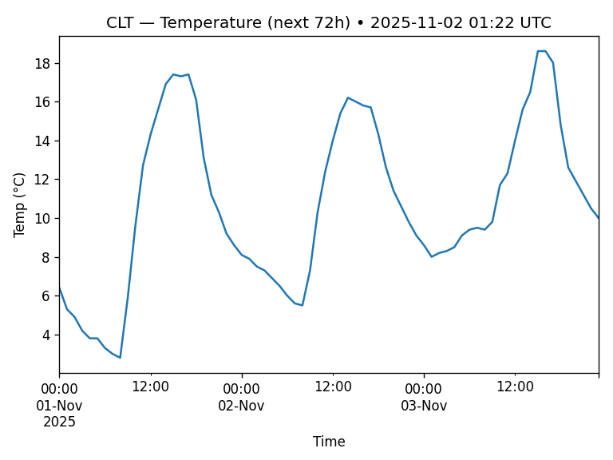

# 001 — Airport Weather (Open-Meteo)

Fetch hourly weather for CLT and plot temperature for the next 72 hours.

**Why it matters:** Weather drives ops. Even this small chart is step one toward delay prediction.

[View the code on GitHub](https://github.com/ahk2710/ali-portfolio/tree/main/projects/001-open-meteo-airport-weather)
